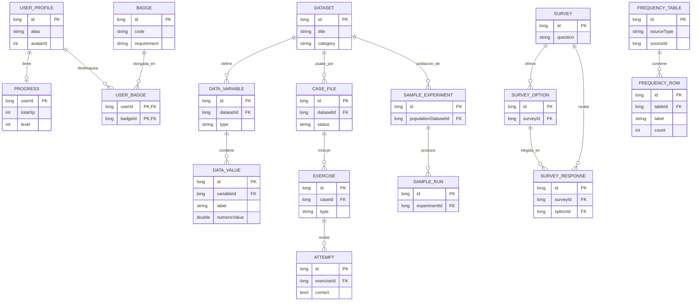

# Base de Datos — Staticdata

Motor: Room sobre SQLite. Base de datos `staticdata.db`. Esquema completo
también disponible en `database/schema.sql`; datos de ejemplo en
`database/sample_data.sql`.

## 1. Tablas

### user_profile
| Campo | Tipo | Notas |
|---|---|---|
| id | INTEGER | PK autogenerada |
| alias | TEXT | alias elegido, nunca nombre real |
| avatarId | INTEGER | 0–7 |
| createdAtEpochMillis | INTEGER | |
| onboardingCompleted | INTEGER (bool) | |
| soundEnabled | INTEGER (bool) | default 1 |
| hapticsEnabled | INTEGER (bool) | default 1 |

### progress
| Campo | Tipo | Notas |
|---|---|---|
| userId | INTEGER | PK, FK → user_profile.id |
| totalXp | INTEGER | |
| level | INTEGER | 1–8 |
| casesCompleted | INTEGER | |
| exercisesCompleted | INTEGER | |
| exercisesCorrectFirstTry | INTEGER | |

### dataset / data_variable / data_value
Un `dataset` (título, categoría) tiene una `data_variable` (nombre, tipo
`CATEGORICA`/`NUMERICA`) con N `data_value` (etiqueta y/o valor numérico).
FK en cascada: borrar un dataset borra su variable y sus valores.

### case_file
Expediente narrativo ligado a un `dataset` (FK). Campos: título,
briefing, categoría, `minLevel` (nivel necesario para desbloquear),
`status` (`BLOQUEADO`/`DISPONIBLE`/`INICIADO`/`COMPLETADO`/`DOMINADO`),
`orderIndex`.

### survey / survey_option / survey_response
Encuesta local creada por el jugador. `survey_response` referencia tanto
la encuesta como la opción elegida; `respondentAlias` es de texto libre
(nunca un dato identificable, ya que el usuario solo puede usar alias).

### frequency_table / frequency_row
Caché persistida del resultado de `StatsEngine.frequencyTable()` para un
dataset o encuesta (`sourceType` + `sourceId`), de forma que revisar un
resultado pasado no obliga a recalcular.

### exercise / attempt
`exercise` pertenece a un `case_file`; guarda tipo, enunciado, opciones y
respuesta correcta codificadas como texto (ver §3). `attempt` registra
cada intento del jugador con marca de tiempo y si fue correcto —de aquí
sale también el historial de "ejercicios para repasar" (los que tienen
algún intento incorrecto).

### sample_experiment / sample_run
Un experimento de muestreo referencia una población (`dataset`). Cada
`sample_run` es una tirada real (`StatsEngine.sample`) con su semilla,
tamaño y etiquetas extraídas.

### badge / user_badge
Catálogo fijo de insignias con su `requirement` (p. ej. `CASES:3`).
`user_badge` es la tabla puente (PK compuesta `userId + badgeId`) que
registra cuáles desbloqueó el jugador y cuándo.

## 2. Índices y relaciones

Todas las claves foráneas tienen su índice correspondiente
(`data_variable.datasetId`, `data_value.variableId`, `case_file.datasetId`,
`survey_option.surveyId`, `survey_response.surveyId/optionId`,
`frequency_row.tableId`, `exercise.caseId`, `attempt.exerciseId`,
`sample_experiment.populationDatasetId`, `sample_run.experimentId`,
`user_badge.badgeId`) para acelerar los `JOIN` típicos de la app y evitar
escaneos completos de tabla. Todas las FK usan `ON DELETE CASCADE`.

## 3. Restricciones y decisiones de diseño

- Las columnas `List<String>` (`optionsEncoded`, `correctAnswerEncoded`,
  `givenAnswerEncoded`, `drawnLabelsEncoded`) se guardan como texto plano
  usando el separador de control U+001F (`StringListConverter`), evitando
  una dependencia de JSON solo para listas simples de cadenas.
- `user_badge` usa clave primaria compuesta en vez de id autogenerado
  porque la relación usuario–insignia es única por definición.
- No existe tabla de "sesión" ni de analítica: la app no rastrea uso más
  allá de lo necesario para el propio progreso educativo del jugador.

## 4. Datos semilla

Generados en tiempo de ejecución por `SeedProvider.kt` (no se distribuyen
como .sql de producción para poder derivar las respuestas correctas de
los ejercicios directamente de `StatsEngine` sobre los datos generados):
30 datasets (25 categóricos + 5 numéricos), 10 casos con 30 ejercicios,
3 experimentos de muestreo, 10 insignias. Ver `database/sample_data.sql`
para un extracto representativo y `docs/MANUAL_TECNICO.md §12` para cómo
ampliarlos.

## 5. Consultas importantes

```sql
-- Tabla de frecuencias más reciente de un dataset
SELECT r.* FROM frequency_row r
JOIN frequency_table t ON t.id = r.tableId
WHERE t.sourceType = 'DATASET' AND t.sourceId = :datasetId
ORDER BY t.computedAtEpochMillis DESC, r.count DESC;

-- Ejercicios pendientes de repaso (con algún intento fallido)
SELECT e.* FROM exercise e
INNER JOIN attempt a ON a.exerciseId = e.id
WHERE a.correct = 0
GROUP BY e.id
ORDER BY MAX(a.timestampEpochMillis) DESC;

-- Insignias desbloqueadas de un jugador
SELECT b.* FROM badge b
INNER JOIN user_badge ub ON ub.badgeId = b.id
WHERE ub.userId = :userId;
```

## 6. Diagrama entidad-relación (Mermaid)


